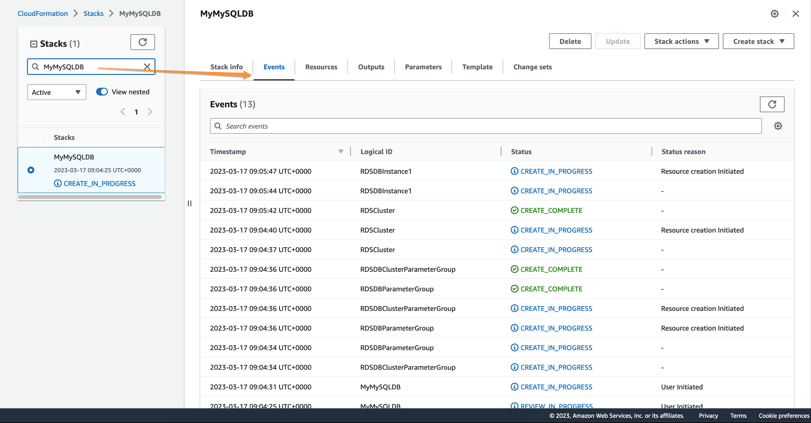
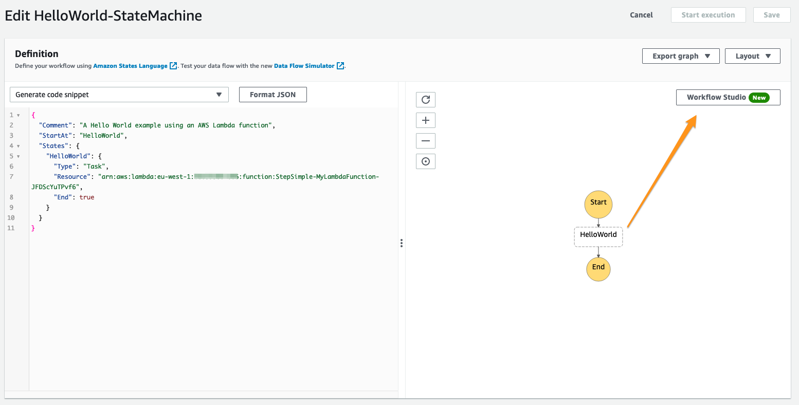
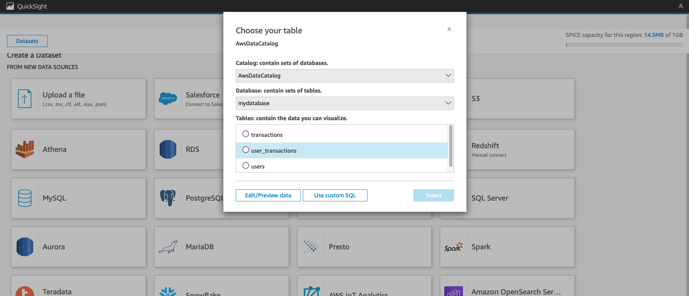
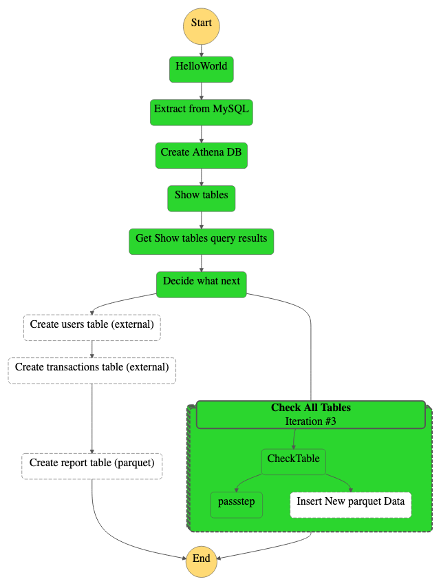
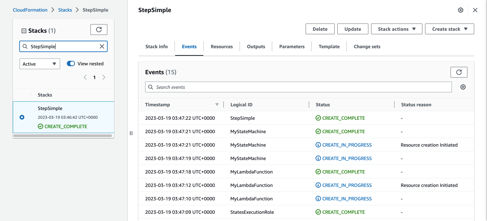
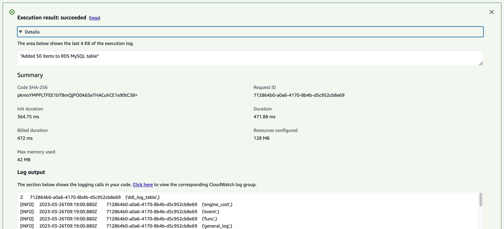
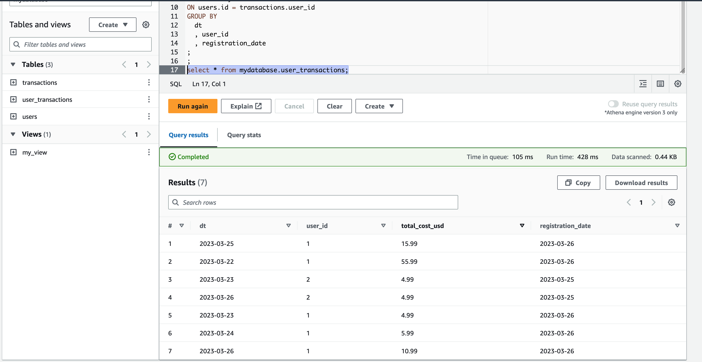
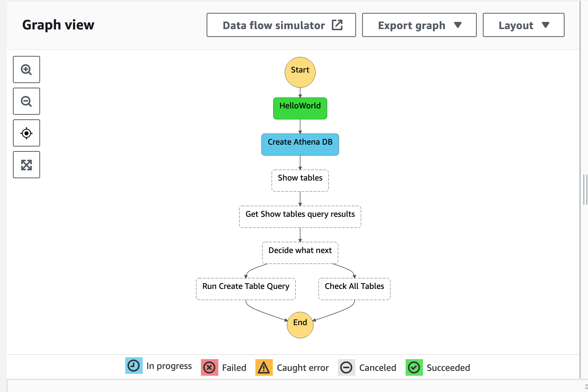
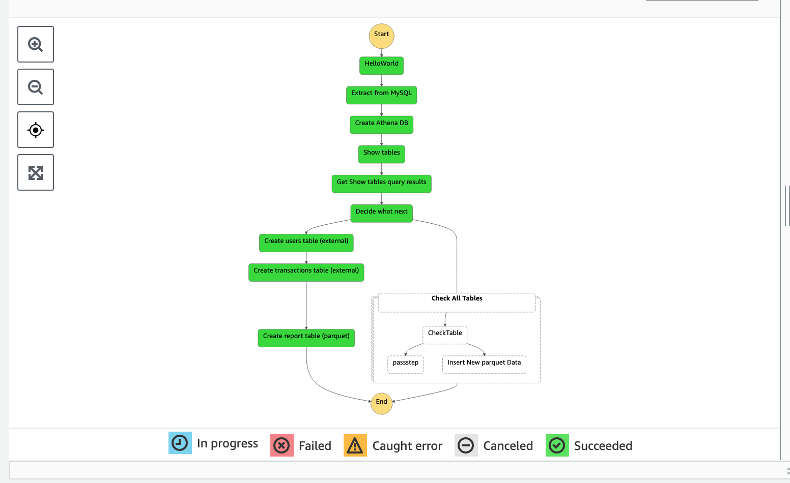

# LP 1
# Build a Data Pipeline in AWS Datalake
# Build a Data Pipeline in AWS Data Lake Connecting Relational Database and Athena


------------------------------------------


## Objective
Learn how to build a near real-time analytics data pipeline using AWS Aurora MySQL, AWS S3, and AWS Athena. Familiarize yourself with AWS Cloudformation templates to provision the resources required for the data pipeline. Those templates will be provided in the project.
Learn how to connect a MySQL data source and prepare data lake data for reading with AWS Athena. Learn how to use AWS Step Funcitons to orchestrate data processing.
Create a dashboard in Quicksight using the resulting dataset.


## Why is this milestone important to the project?

This Project shows how to create a batch-processing data pipeline with AWS Lambda - probably the most cost-effective, flexible and reliable way to create data pipelines.

Batch data processing is the most common data pipeline design pattern. If our data is stored in AWS MySQL Aurora database we might want to export it into the datalake. This project explains how to achieve this and transform data using AWS Athena further down the pipeline.


## Workflow
### 1. Create datalake S3 bucket using AWS Cloudformation template

```sh
aws \
cloudformation deploy \
--template-file datalake_s3_stack.yaml \
--stack-name DatalakeStagingLiveProject \
--capabilities CAPABILITY_IAM
```

Check that the bucket exists.

### 2. Create MySQL Aurora instance using AWS Cloudformation template

Use the attached Cloudformation (cfn) template to create an RDS instance.

```sh
aws \
cloudformation deploy \
--template-file AWS_cfn_mysql_small.yaml \
--stack-name MySQLDB \
--capabilities CAPABILITY_IAM
```
Wait a few minutes and monitor stack creation in AWS console. If everything goes well you will see something like this:


### 3. Create a data pipeline using AWS Step Functions

#### What is a Step Function?
We would want to orchestrate our data pipeline using AWS Step Functions. It's a nice and fairly easy way to create data pipelines for intermediate-level users as it offers a visual editor.

A collection of Step functions is called a State Machine and it consists of states that can do work, i.e. perform ETL and data transformation (Task states). For example. one state can be a simple AWS Lambda Function (Hello world lambda) and we can describe the next state to go to after the Lambda execution is complete. We can add **Choice states** to decide where our task should transition next and we can tell teh State machine to stop execution if we get an error (Fail states), etc.

> State machines can be described using JSON

Try to create a simple state machine and see what JSON definition it will create.



### 4.  Create a Quicksight dashboard
Connect our final Athena dataset `mydataset.user_transactions` to create a dashboard.


## Deliverable

The deliverable for this milestone is a fully functioning data pipeline as described in Data pipeline overview section below.

Feel free to deploy it any way you like, i.e. using AWS CLI, Cloudformation or Visual Editor in AWS console.




#### Data pipeline overview
We would want to create a data pipeline where data is being transformed in sthe following steps:

1. Add a simple Lambda Function that outputs "Hello World"
2. Add another Lambda function that extracts data from MySQL database tables `myschema.users` and `myschema.transactions` into AWS S3 datalake bucket. These tables will be used later to create external tables using AWS Athena and can be defined by as follows:
```sql
CREATE TABLE IF NOT EXISTS
  myschema.users AS
SELECT
  1 AS id,
  CURRENT_DATE() AS registration_date
UNION ALL
SELECT
  2 AS id,
  DATE_SUB(CURRENT_DATE(), INTERVAL 1 day) AS registration_date;

CREATE TABLE IF NOT EXISTS
  myschema.transactions AS
SELECT
  1 AS transaction_id,
  1 AS user_id,
  10.99 AS total_cost,
  CURRENT_DATE() AS dt
UNION ALL
SELECT
  2 AS transaction_id,
  2 AS user_id,
  4.99 AS total_cost,
  CURRENT_DATE() AS dt
UNION ALL
SELECT
  3 AS transaction_id,
  2 AS user_id,
  4.99 AS total_cost,
  DATE_SUB(CURRENT_DATE(), INTERVAL 3 day) AS dt
UNION ALL
SELECT
  4 AS transaction_id,
  1 AS user_id,
  4.99 AS total_cost,
  DATE_SUB(CURRENT_DATE(), INTERVAL 3 day) AS dt
UNION ALL
SELECT
  5 AS transaction_id,
  1 AS user_id,
  5.99 AS total_cost,
  DATE_SUB(CURRENT_DATE(), INTERVAL 2 day) AS dt
UNION ALL
SELECT
  6 AS transaction_id,
  1 AS user_id,
  15.99 AS total_cost,
  DATE_SUB(CURRENT_DATE(), INTERVAL 1 day) AS dt
UNION ALL
SELECT
  7 AS transaction_id,
  1 AS user_id,
  55.99 AS total_cost,
  DATE_SUB(CURRENT_DATE(), INTERVAL 4 day) AS dt
;

```

3. Create a State Machine node with Athena resource to start execution (`arn:aws:states:::athena:startQueryExecution.sync`) and create a database called `mydatabase`

4. Create another node to show existing tables in Athena database. Use the ouput of this node to decide what to do next.

5. Decide what to do next

5.1. If tables don't exist then create them in Athena based on the data from datalake S3 bucket.
We would want to create two external tables with data from MySQL:
- mydatabase.users (LOCATION  's3://<YOUR_DATALAKE_BUCKET>/data/myschema/users/')
- mydatabase.transactions (LOCATION  's3://<YOUR_DATALAKE_BUCKET>/data/myschema/transactions/')

Then we would want to create an optimized ICEBERG table:
- mydatabase.user_transactions ('table_type'='ICEBERG', 'format'='parquet')

This table should return this SQL query result:
```sql
  SELECT 
      date(dt) dt
    , user_id
    , sum(total_cost) total_cost_usd
    , registration_date
  FROM mydatabase.transactions 
  LEFT JOIN mydatabase.users
  ON users.id = transactions.user_id
  GROUP BY
    dt
    , user_id
    , registration_date
;
```

5.2. If source tables exist then iterate through table names until `user_transaction` table is found and update this table using `MERGE` statement.

6. END.

Deploy a simple stack with a template solution and start changing it step by step:

```sh
```sh
aws --profile mds \
cloudformation deploy \
--template-file step_simple.yaml \
--stack-name StepSimple \
--capabilities CAPABILITY_IAM
```



We have created a simple Step Function and can use it as a template to extend and improve our ETL pipeline.

When we finish our final solution our solution folder should look like this:
~~~bash
Mikes-MBP:batch-etl-example
.
└── stack
    ├── mysql_connector
    │   └── app.py
    ├── package
    │   ├── PyMySQL-1.0.2.dist-info
    │   └── pymysql
    └── stack.zip
~~~


## Help
* [Manning resouce: AWS Lambda in Action](https://www.manning.com/books/aws-lambda-in-action?query=AWS%20Lambda%20in%20Action)
* [Manning Book: Designing cloud data platforms ](https://livebook.manning.com/book/designing-cloud-data-platforms/welcome/v-8/).


### Hint for Step 2 of the Data pipeline 
To create a Lambda function to extract data from MySQL database we need to create a folder for our Lambda first:
To do so create a new folder called `mysql_connector`:
```sh
mkdir stack
cd stack
mkdir mysql_connector
```

Then we can use this code below (replace database connection settings with yours) to create `app.py`:
```python
import sys
import logging
import pymysql
import json

# rds settings to replace with outputs from your RDS stack:
rds_host  = "mymysqldb.12345678.eu-west-1.rds.amazonaws.com"
user_name = "root"
password = "AmazingPassword"
db_name = "mysql"

logger = logging.getLogger()
logger.setLevel(logging.INFO)

# create the database connection outside of the handler to allow connections to be
# re-used by subsequent function invocations.
try:
    conn = pymysql.connect(host=rds_host, user=user_name, passwd=password, db=db_name, connect_timeout=5)

except pymysql.MySQLError as e:
    logger.error("ERROR: Unexpected error: Could not connect to MySQL instance.")
    logger.error(e)
    sys.exit()

logger.info("SUCCESS: Connection to RDS MySQL instance succeeded")

def lambda_handler(event, context):
    """
    This function creates a new RDS database table and writes records to it
    """
    try: 
        message = event['Records'][0]['body']
    except: 
        message = "{\n     \"sql\": \"select 1;\",\n     \"user\": \"mshakhomirov\"\n}"
    data = json.loads(message)
    UserId = data['user']
    Sql = data['sql']

    item_count = 0
    sql_string = f"insert into Customer (CustID, Name) values({UserId}, '{Sql}')"

    with conn.cursor() as cur:
        cur.execute("create schema if not exists myschema;")
        cur.execute("create table if not exists myschema.users as select 1 as id, current_date() as registration_date union all select 2 as id, date_sub(current_date(), interval 1 day)  as registration_date;")
        cur.execute("create table if not exists myschema.transactions as select 1 as transaction_id, 1 as user_id, 10.99 as total_cost, current_date() as dt union all select 2 as transaction_id, 2 as user_id, 4.99 as total_cost, current_date() as dt union all select 3 as transaction_id, 2 as user_id, 4.99 as total_cost, date_sub(current_date(), interval 3 day) as dt union all select 4 as transaction_id, 1 as user_id, 4.99 as total_cost, date_sub(current_date(), interval 3 day) as dt union all select 5 as transaction_id, 1 as user_id, 5.99 as total_cost, date_sub(current_date(), interval 2 day) as dt union all select 6 as transaction_id, 1 as user_id, 15.99 as total_cost, date_sub(current_date(), interval 1 day) as dt union all select 7 as transaction_id, 1 as user_id, 55.99 as total_cost, date_sub(current_date(), interval 4 day) as dt ;")
        cur.execute("SELECT * FROM myschema.transactions INTO OUTFILE S3 's3://<YOUR_S3_BUCKET>/data/myschema/transactions/transactions.scv' FIELDS TERMINATED BY ',' LINES TERMINATED BY '\n' OVERWRITE ON;")
        cur.execute("SELECT * FROM myschema.users INTO OUTFILE S3 's3://<YOUR_S3_BUCKET>/data/myschema/users/users.csv' FIELDS TERMINATED BY ',' LINES TERMINATED BY '\n' OVERWRITE ON;")
        cur.execute("show tables;")
        # cur.execute("create table if not exists Customer ( CustID  int NOT NULL, Name varchar(255) NOT NULL, PRIMARY KEY (CustID))")
        # cur.execute(sql_string)
        conn.commit()
        # cur.execute("select * from Customer")
        logger.info("Successfully connected and found tables in the database:")
        for row in cur:
            item_count += 1
            logger.info(row)
    conn.commit()

    return "Found %d items to RDS MySQL database" %(item_count)

```
Try to deploy a standalone Lambda function first and test if it works. 
To deploy with AWS CLI run this (assuming you are in the ./stack folder) in your command line:
```sh
# Package Lambda code:
base=${PWD##*/}
zp=$base".zip" # This will return stack.zip if you are in stack folder.
echo $zp
 
rm -f $zp # remove old package if exists

pip install --target ./package pymysql 

cd package
zip -r ../${base}.zip .

cd $OLDPWD
zip -r $zp ./mysql_connector

```

Make sure that AWS Lambda role exists before running the next part `--role arn:aws:iam::<your-aws-account-id>:role/my-lambda-role`.


```sh
# Deploy packaged Lambda using AWS CLI:
aws \
lambda create-function \
--function-name mysql-lambda \
--zip-file fileb://stack.zip \
--handler app.lambda_handler \
--runtime python3.8 \
--role arn:aws:iam::<your-aws-account-id>:role/my-lambda-role

# # If already deployed then use this to update:
# aws --profile mds lambda update-function-code \
# --function-name mysql-lambda \
# --zip-file fileb://stack.zip;
```

### Hint for Step 2. How to create Lambda role.
#### Create role
Our Lambda function will need an execution role on order to access other AWS resources. Read more about Execution roles [here](https://docs.aws.amazon.com/lambda/latest/dg/lambda-intro-execution-role.html)

```sh
aws \
iam create-role \
--role-name my-lambda-role \
--assume-role-policy-document file://trust-policy.json
```
or
```sh
aws \
iam create-role \
--role-name my-lambda-role \
--assume-role-policy-document '{ "Version": "2012-10-17", "Statement": [ { "Effect": "Allow", "Principal": { "Service": "lambda.amazonaws.com" }, "Action": "sts:AssumeRole" } ] }'
```

In this shell command, you tell AWS API to create `my-lambda-role` using [trust policy](https://docs.aws.amazon.com/IAM/latest/UserGuide/id_roles_terms-and-concepts.html#delegation) specified in `trust-policy.json` which must exist in the current directory where you run this shell command.


The output should be something like that:
```sh
{
    "Role": {
        "Path": "/",
        "RoleName": "my-lambda-role",
        "RoleId": "AROA4UMCC3MDNU6SDRUUA",
        "Arn": "arn:aws:iam::123456789:role/my-lambda-role",
        "CreateDate": "2022-11-29T17:28:31+00:00",
        "AssumeRolePolicyDocument": {
            "Version": "2012-10-17",
            "Statement": [
                {
                    "Effect": "Allow",
                    "Principal": {
                        "Service": "lambda.amazonaws.com"
                    },
                    "Action": "sts:AssumeRole"
                }
            ]
        }
    }
}
```

#### Add permissions to your Lambda role
```sh
aws \
iam attach-role-policy \
--role-name my-lambda-role \
--policy-arn arn:aws:iam::aws:policy/service-role/AWSLambdaBasicExecutionRole
```
This will grant the permissions that the function needs to write logs to CloudWatch Logs.
After that we should be ready to deploy our Lambda.

### Hint for Step 2. How to invoke our MySQL Lambda after it has been successfully deployed in AWS
Any Lambda can be invoked from AWS Console with test event. Supply this input for our test event:

```json
{
  "Records": [
    {
      "body": "{\n     \"registration_date\": \"2023-01-01\",\n     \"user\": \"mshakhomirov\"\n}"
    }
  ]
}
```

If everything is good you will be able to see this in AWS console after Lambda execution:


Our Lambda also exports the data into s3. To check if the data is there in your command line run this:
```sh
aws s3 ls s3://<YOUR_S3_BUCKET>t/data/myschema/mytable/ --human-readable --summarize --recursive
# You should see something like this:
# 2023-03-26 10:28:07    8 Bytes data/myschema/mytable/transactions.part_00000
# 2023-03-19 13:19:20    8 Bytes data/myschema/mytable/users.part_00000

# Total Objects: 2
#    Total Size: 16 Bytes
```

### Hint for Step 2. How to add MySQL Lambda to our State Machine graph

When we create or edit our Step functions using Visual editor it generates a JSON definition like so:
```json
            {
              "Comment": "A Hello World example using an AWS Lambda function",
              "StartAt": "HelloWorld",
              "States": {
                "HelloWorld": {
                  "Type": "Task",
                  "Resource": "${lambdaArn}",
                  "Next": "Extract from MySQL"
                },
                "Extract from MySQL": {
                  "Resource": "${MySQLLambdaArn}",
                  "Type": "Task",
                  "Next": "Create Athena DB"
                },
                "Create Athena DB": {
                }
                ...
            }
```

To add our MySQL Lambda as a node we can add it with this JSON code:
```json
                "Extract from MySQL": {
                  "Resource": "${MySQLLambdaArn}",
                  "Type": "Task",
                  "Next": "Create Athena DB"
                },
```
Replace ${MySQLLambdaArn} with actual Lambda Arn.


### Hint for Step 5 of our data pipeline. How to create Athena tables

We would want to create two external Athena tables with data from MySQL:
- myschema.users
- myschema.transactions

Then we would want to create an optimized ICEBERG table:
- myschema.user_transactions

We would want to INSERT new data into that table using MERGE statement.

```sql
CREATE EXTERNAL TABLE mydatabase.users (
    id                bigint
  , registration_date string
) 
ROW FORMAT DELIMITED
FIELDS TERMINATED BY ',' 
STORED AS INPUTFORMAT   'org.apache.hadoop.mapred.TextInputFormat'
OUTPUTFORMAT   'org.apache.hadoop.hive.ql.io.HiveIgnoreKeyTextOutputFormat' 
LOCATION  's3://<YOUR_S3_BUCKET>/data/myschema/users/' TBLPROPERTIES (  'skip.header.line.count'='0')
;
select * from mydatabase.users;

CREATE EXTERNAL TABLE mydatabase.transactions (
    transaction_id    bigint
  , user_id           bigint
  , total_cost        double
  , dt                string
) 
ROW FORMAT DELIMITED
FIELDS TERMINATED BY ',' 
STORED AS INPUTFORMAT   'org.apache.hadoop.mapred.TextInputFormat'
OUTPUTFORMAT   'org.apache.hadoop.hive.ql.io.HiveIgnoreKeyTextOutputFormat' 
LOCATION  's3://<YOUR_S3_BUCKET>/data/myschema/transactions/' TBLPROPERTIES (  'skip.header.line.count'='0')
;
select * from mydatabase.transactions;


CREATE TABLE IF NOT EXISTS mydatabase.user_transactions (
  dt date,
  user_id int,
  total_cost_usd float,
  registration_date string
) 
PARTITIONED BY (dt)
LOCATION 's3://<YOUR_S3_BUCKET>/data/myschema/optimized-data-iceberg-parquet/' 
TBLPROPERTIES (
  'table_type'='ICEBERG',
  'format'='parquet',
  'write_target_data_file_size_bytes'='536870912',
  'optimize_rewrite_delete_file_threshold'='10'
)
;


MERGE INTO mydatabase.user_transactions  as ut
USING (
  SELECT 
      date(dt) dt
    , user_id
    , sum(total_cost) total_cost_usd
    , registration_date
  FROM mydatabase.transactions 
  LEFT JOIN mydatabase.users
  ON users.id = transactions.user_id
  GROUP BY
    dt
    , user_id
    , registration_date
) as ut2
ON (ut.dt = ut2.dt and ut.user_id = ut2.user_id)
WHEN MATCHED
    THEN UPDATE
        SET total_cost_usd = ut2.total_cost_usd, registration_date = ut2.registration_date
WHEN NOT MATCHED 
THEN INSERT (
 dt
,user_id
,total_cost_usd
,registration_date
)
  VALUES (
 ut2.dt
,ut2.user_id
,ut2.total_cost_usd
,ut2.registration_date
)
;
```

When new table is ready you can check it by running `SELECT *`:



## Partial solution

```sh
aws \
cloudformation deploy \
--template-file step_simple.yaml \
--stack-name StepSimple \
--capabilities CAPABILITY_IAM
```


We have just created a simple Step Function and can use it as a template to extend and improve our ETL pipeline.

You can start changing this pipeline JSON definition to get a more sophisticated solution like this one below.
It has a view created in Athena.
```sh
aws \
cloudformation deploy \
--template-file step_partial.yaml \
--stack-name ETLSolutionStaging \
--capabilities CAPABILITY_IAM
```

It's always good to have your AWS web console opened on State Machines to examine the graph view:


## Full solution

Full solution includes the following:
- AWS Lambda Function to execute SQL query
- Athena Tables created with Step Functions

To deploy Full solution in your AWS account simply run this in your command lineas a whole shell script (copy and paste). Make sure <YOUR_S3_BUCKET> exists and replace it with your actual S3 bucket:
```sh
# deploy.sh starts here:
date
TIME=`date +"%Y%m%d%H%M%S"`

MySQLLambdaLocation="<YOUR_S3_BUCKET>/lambdas/mysql_connector"
base=${PWD##*/}
zp=$base".zip" # This will return stack.zip if you are in stack folder.
echo $zp
 
rm -f $zp

pip install --target ./package pymysql 

cd package
zip -r ../${base}.zip .

cd $OLDPWD

zip -r $zp ./mysql_connector

aws s3 cp ./${base}.zip s3://${MySQLLambdaLocation}/${base}${TIME}.zip
# Result:
# upload: ./stack.zip to s3://datalake.staging.liveproject/lambdas/mysql_connector/stack.zip

aws \
cloudformation deploy \
--template-file step_full.yaml \
--stack-name ETLSolutionStaging \
--capabilities CAPABILITY_IAM \
--parameter-overrides "S3LambdaKey"="lambdas/mysql_connector/${base}${TIME}.zip"
```
Keep in mind that everytime we deploy code changes we would want to create a new stack zip file with unique name. Otherwise Cloudformation will not propagate the changes.
```sh
upload: ./stack.zip to s3://datalake.staging.liveproject/lambdas/mysql_connector/stack20230326092933.zip
```

After we deploy the changes our final dag will be like this:



------------------------------------------------

