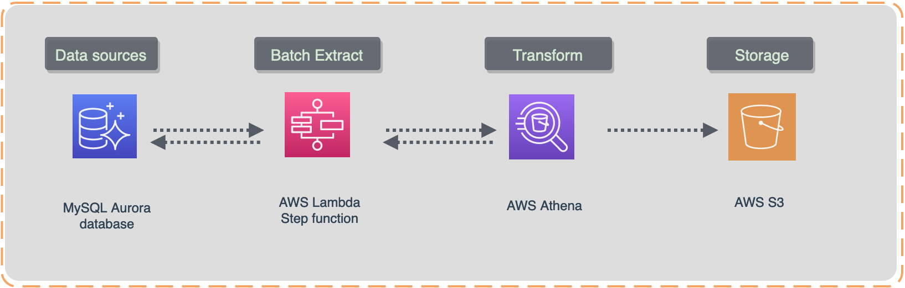

# LP1 Intro
This Project shows how to create a batch processing data pipeline with AWS Lambda.

Connect a MySQL data source and prepare data lake data for reading with AWS Athena. Apply ETL transformations and store the results in an AWS S3 storage bucket. In the final step data will be processed and transformed with AWS Athena to create a dynamic dashboard with AWS Quicksight. 

## Scenario
As a data engineer you need to create a business intelligence dashboard that displays the geography of company revenue streams. Raw payment data is stored in the server database (AWS Aurora MySQL). You want to build a batch pipeline that extracts data from that database daily, then use AWS S3 to store the data and AWS Athena to process it.

## Techniques, tools and libraries
- AWS SDK
- AWS CLI
- Python 3.8
- Athena (engine 3)
- Bash scripting
- BI development
- AWS Quicksight (30 days free trial available for everyone)

## Repo
[https://github.com/manning-liveproject/build-a-ml-pipeline-in-aws-lake-house-lp-author](https://github.com/manning-liveproject/build-a-ml-pipeline-in-aws-lake-house-lp-author)

## Keywords
datalake, AWS, serverless, lambda function, step funstions, data architecture, ETL, data pipeline, MySQL.
